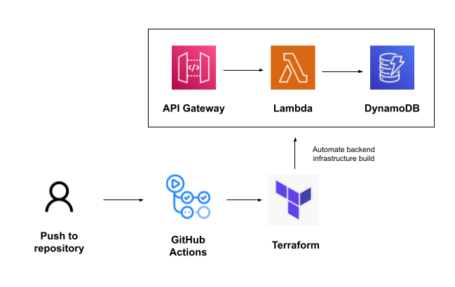

# AWS Resume Challenge

The AWS Resume Challenge, created by Forrest Brazeal, gave me a hands-on opportunity to build a full-stack web application on AWS. I created a dedicated frontend and backend, integrated the two, and automated the entire development process using IaC and CI/CD best practices.

The ask was deceptively simple: create a personal website that would keep a count of the number of times it’s visited. That was until I read [the steps](https://cloudresumechallenge.dev/docs/the-challenge/aws/) I would have to take to create the website.

In this README, I will go over how I created the backend. One of its key components is the API, which triggers each time my website is visited, and returns an updated count.

## Backend Infrastructure

1. The JavaScript code on the client side communicates with the underlying database via an HTTP API. I created one using API Gateway and integrated it with my Lambda function.
2. The Lambda function was developed after this. I used Python and the boto3 library and attached the appropriate role to this function using IAM.
3. Every time the function was triggered by my API, it would update the visitor count on my database, which was housed in DynamoDB.

But this was all done manually on the AWS console. The real fun began when I had to rebuild the entire backend infrastructure with code, using a language I had never encountered before – Terraform. It took me a fair bit of time to wrap my head around IaC, but the effort paid off. Terraform saves a great deal of time by automating the entire infrastructure build process. You can find my Terraform code attached to this repository.

I had heard of CI/CD before, but never internalized its power until I used GitHub Actions. Across my frontend and backend, any time I made a change to my code and pushed it to its respective repository, a GitHub workflow (.github/workflows) would get triggered. Once the tests passed, the build would get packaged and deployed to AWS.

## Summary

Despite the occasional struggles, I thoroughly enjoyed the entire learning process. I now have a solid foundational understanding of AWS that wouldn’t have been possible to acquire by passing certifications. I look forward to working on more projects and deepening my understanding.

Thanks for reading! Please find my frontend repository linked [here](https://github.com/kpath1999/resume-frontend).

